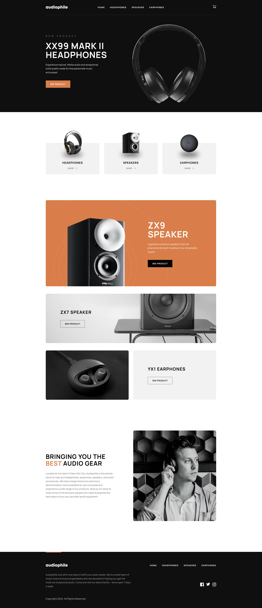
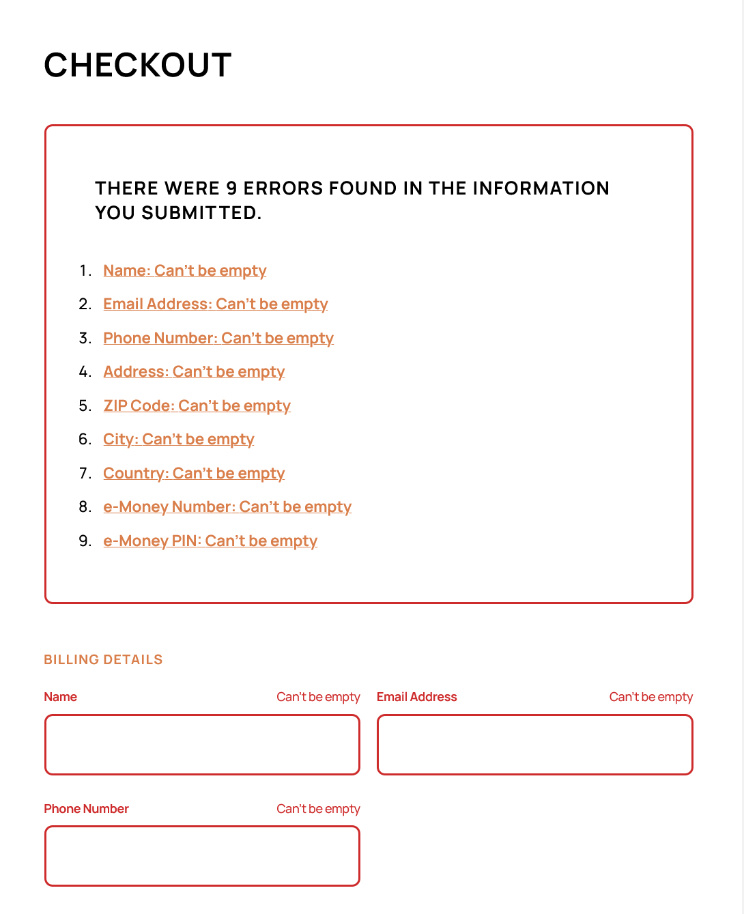

# Frontend Mentor - Audiophile e-commerce website solution

This is a solution to the [Audiophile e-commerce website challenge on Frontend Mentor](https://www.frontendmentor.io/challenges/audiophile-ecommerce-website-C8cuSd_wx).

## Table of contents

- [Overview](#overview)
  - [The challenge](#the-challenge)
  - [Screenshot](#screenshot)
  - [Links](#links)
- [My process](#my-process)
  - [Built with](#built-with)
  - [What I learned](#what-i-learned)
  - [Continued development](#continued-development)
  - [Useful resources](#useful-resources)
- [Author](#author)
- [Acknowledgments](#acknowledgments)

## Overview

### The challenge

Users should be able to:

- View the optimal layout for the app depending on their device's screen size
- See hover states for all interactive elements on the page
- Add/Remove products from the cart
- Edit product quantities in the cart
- Fill in all fields in the checkout
- Receive form validations if fields are missed or incorrect during checkout
- See correct checkout totals depending on the products in the cart
  - Shipping always adds $50 to the order
  - VAT is calculated as 20% of the product total, excluding shipping
- See an order confirmation modal after checking out with an order summary
- **Bonus**: Keep track of what's in the cart, even after refreshing the browser

### Screenshot

### Links

- Solution URL: [Frontend Mentor Solution](https://www.frontendmentor.io/solutions/ecommerce-app-using-nextjs-14-and-framer-motion-VhpP0IVCSP)
- Live Site URL: [Live Site at Vercel](https://audiophile-liard.vercel.app/)

## My process

### Built with

- Semantic HTML5 markup
- CSS custom properties
- Flexbox
- CSS Grid
- Desktop-first workflow
- [React](https://reactjs.org/) - JS library
- [Next.js](https://nextjs.org/) - React framework
- [Framer Motion](https://www.framer.com/motion/) - For easy spring and layout animations

### What I learned

I used native <dialog> component while working on this project. It does a lot of heavy-lifting for free, like making everything outside the dialog 'inert', managing focus etc.

I followed [advice from Marcy Sutton](https://www.gatsbyjs.com/blog/2019-07-11-user-testing-accessible-client-routing/) on accessible client-side navigation. When user changes routes, the focus goes immediately to the main header. It's not the best option, but the skip-links recommended by Marcy were not in the original design, so I decided to go with the next best thing.

In terms of accessibility of the cart, I mainly went with [Target-like implementation](https://www.target.com/), where the cart button itself has an accessible name of the amount of items in the cart. I think it makes sense.

I followed the best practices on building accessible forms, and created an error summary component. If user have errors in the form and clicks the submit button, the focus immediately shifts to the heading of the summary, announcing how many mistakes they made. The errors are listed below as anchors pointing to the input with error.
[Gov.uk](https://design-system.service.gov.uk/components/error-summary/) uses the same pattern.

I also built a Toast component, that notifies users when they make changes to the cart. It is made using 'aria-live' regions. These articles by [Sara Souiedan](https://www.sarasoueidan.com/blog/accessible-notifications-with-aria-live-regions-part-1/) and [Heydon Pickering](https://inclusive-components.design/notifications/) were extremely helpful in achieving this.

## Author

- Frontend Mentor - [@Akherousin](https://www.frontendmentor.io/profile/Akherousin)
